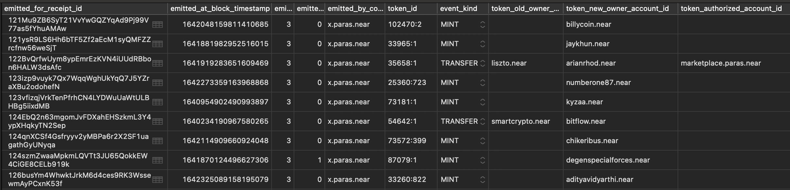

### FT/NFT contracts

We have [FT](https://nomicon.io/Standards/FungibleToken/Event.html) and [NFT](
https://nomicon.io/Standards/NonFungibleToken/Event.html) events standards.

I've created a simple contract that emulates FT/NFT contract by providing logs.  
[Indexer](https://github.com/near/near-indexer-for-explorer) parses these logs and adds the information to the corresponding tables.

It's enough just to have a proper structure of json; Indexer will catch these events.
We have no checks whether the accounts are real.
Though, it has no sense to provide indexer with the fake data: Wallet and other apps will ignore non-existing accounts.

You can see the code [here](src/lib.rs).

The data is available in Indexer DB:
```sql
SELECT *
FROM assets__non_fungible_token_events
LIMIT 100;

SELECT *
FROM assets__fungible_token_events
LIMIT 100;
```




To use this contract at the localnet, you need to run Indexer, then run the following commands:
```bash
node compile.js
NEAR_ENV=local near deploy --wasmFile path_to_sources/target/wasm32-unknown-unknown/release/nft_duck.wasm --accountId test.near
NEAR_ENV=local near call test.near move_ft '{}' --accountId test.near
NEAR_ENV=local near call test.near move_nft '{}' --accountId test.near
```
